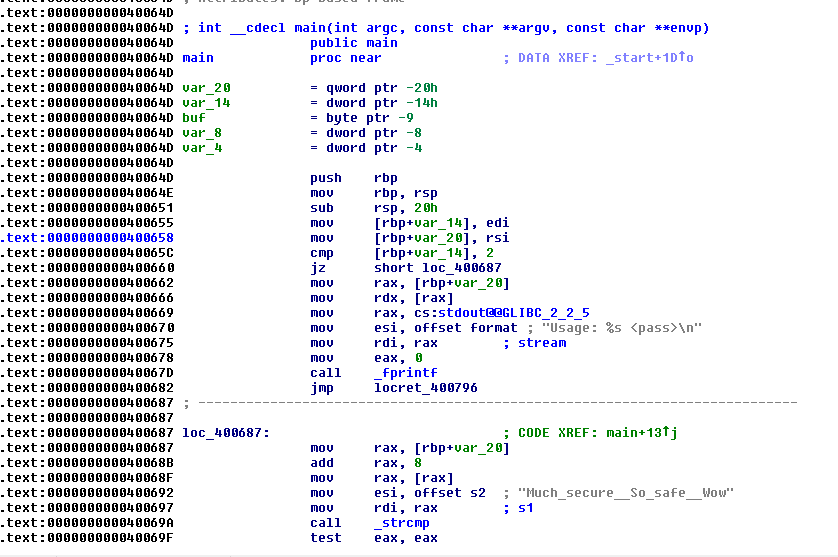

# Matriochka - Step 1
The challenge starts with a `stage1.bin` binary file.

## Investigation
We opened the file in IDA pro to find this screen:

We immediately see that the program asks for password and just after that
it moves a string into the esi register.
We guessed that the password might be this string: Much_secure__So_safe__Wow.
The flag is the password!

## Stage 2 Extraction
Once you enter the password, the program outputs a b64 data blob. We tried to decode this blob and put it in a file.
This gave us the binary for the next challenge!