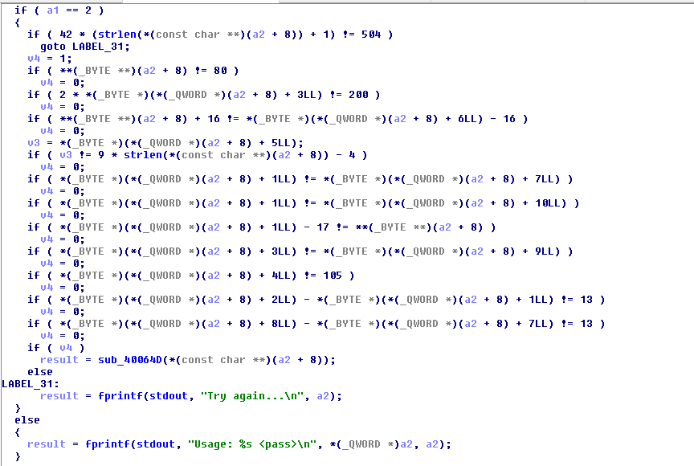

# Matriochka - Step 2
The challenge starts with `stage2.bin` binary file found at the end of the Step 1.

## Investigation
We opened the file in IDA pro to find this screen. This time the assembly was looking very complicated, so we decided to use the mighty
F5 button to generate a pseudocode. After looking through all the available functions. We stumbled upon this interesting function:

This is definitely the password verification function! So we started from the top to find the value of each character.

For the first character, we have the line: **(_BYTE **)(a2 + 8) != 80

We can safely assume that a2+8 is the position of the first character of the string when we look at the co
de!
So we have string[0] = 80 = 'P'.

Now for the fourth character we have the line: 2* *(_BYTE *)(*(_QWORD *)(a2 + 8) + 3LL) != 200

We can simplify this line like this: 2*string[3] != 200

So we have string[3] = 100 = d

Rinse and repeat for the rest of the characters.

We end up with the string: Pandi_panda which is our flag also.

## Stage 3 Extraction
Once you enter the password, the program outputs a b64 data blob. We tried to decode this blob and put it in a file.
This gave us the binary for the next challenge!