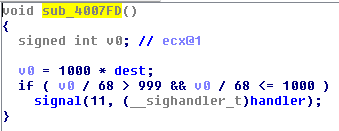

# Matriochka - Step 3
The challenge starts with `stage3.bin` binary file found at the end of the Step 2.

## Investigation
We opened the file in IDA pro to find this screen. Once again, the assembly was looking very complicated, so we decided to use the mighty
F5 button to generate a pseudocode. After looking through all the available functions. We stumbled upon this interesting function which seemed to be the main:

The program seems to make use of the unix signals. The signal function fires up the specified function when the bound signal is fired.
We simply assumed that the functions are somehow called, so we went inside the sub_4007FD function to look for more!

This definitely looks like a char validation! We immediatly find that v0 must equal 1000. So dest=68.

In the main function, we can see that dest is the initial location of the password. So char[0] = 68 = D

After that we went into the handler function which had exactly the same format as sub_4007FD.

Rinse and repeat and we find the password/flag: Did_you_like_signals?

## Stage 4 Extraction
Once you enter the password, the program outputs a b64 data blob. We tried to decode this blob and put it in a file.
This gave us the binary for the next challenge!