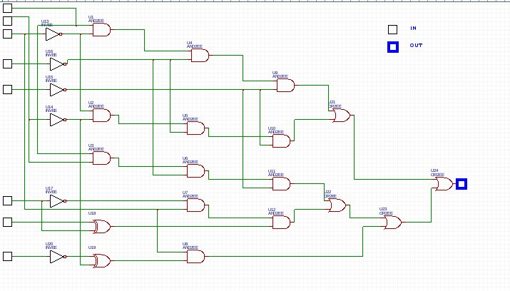

# Invest
The challenge starts with a `pcacpng` file containing HTTP traffic.

## Investigation
We start off by extracting all the HTTP objects with `Wireshark`.
Already, we see some interesting stuff:
- `encryptaa`, `encryptab`, ... (files that look encoded in base64)
- `key.txt` (file with a sequence of `1`s and `0`s)
- image of a logic circuit:



`key.txt` has a number of characters that is a multiple of 8 (the number of
inputs in that logic circuit). Coincidence? Surely not.

We split the job in two teams: one working on passing every group of 8-bits from
that `key.txt` file into the logic circuit, the other trying to figure out what
the `encryptxx` files represent.


## Key Extraction
The first team came up with the glorious
[`convert_key.py`](convert_key.py) script (Python 2).

Running it gives us the following: 
`001101000101010101101011011110100011100100110101010001100011001001011001011100010101000001101001`

Converting that to a hex number (thanks Python):
```
> hex(0b001101000101010101101011011110100011100100110101010001100011001001011001011100010101000001101001)
0x34556b7a3935463259715069
```

## `encryptxx` Files
Intuition tells us that we should concat the files together:
`cat encrypt* > encrypted`

Taking a look at the contents of `encrypted` by base64-decoding it
(`cat encrypted | base64 -d`), we see that the result starts with the string
`Salted__`.

Googling tells us that this is the
[OpenSSL salted format](http://justsolve.archiveteam.org/wiki/OpenSSL_salted_format).

Our guess is then that we need to decrypt that file using the key that we
extracted previously. In other words, we want a line that looks like the
following to give us something that makes sense:

```
openssl aes-128-cbc -a -d -in encrypted -out decrypted
(`-a` for base64, `-d` to decrypt)
```
although the `aes-128-cbc` algorithm is not necessarily the right one.

## Algorithm Brute-force
Let's start by putting our hex password in a binary file:
`echo “34556b7a3935463259715069” | xxd -r -p - key.bin`

Now, we want to try all the available algorithms in OpenSSL to find the right
one. We also print some information about the decoded files to see if we can
find something interesting (show `file` and `strings` output) to tell us if we
properly decrypted it.

See [`try_algos.sh`](try_algos.sh) for our bash script that does just that.

Surprise!
```
...
decrypted/aes-256-cbc: Microsoft Word 2007+
...
```

## Getting trolled
Opening the Word file, we are greeted with a nice little troll image:


No way. It has to be there.

Since Word files can be unzipped:
```
> unzip word.docx
> grep -i -r ndh word
NDH[59rRS57bd5WH8RxgPbRS27q89a5bWrjL]
```

:partyhat:

Flag acquired.

Bonus: we were the first team to submit it.
